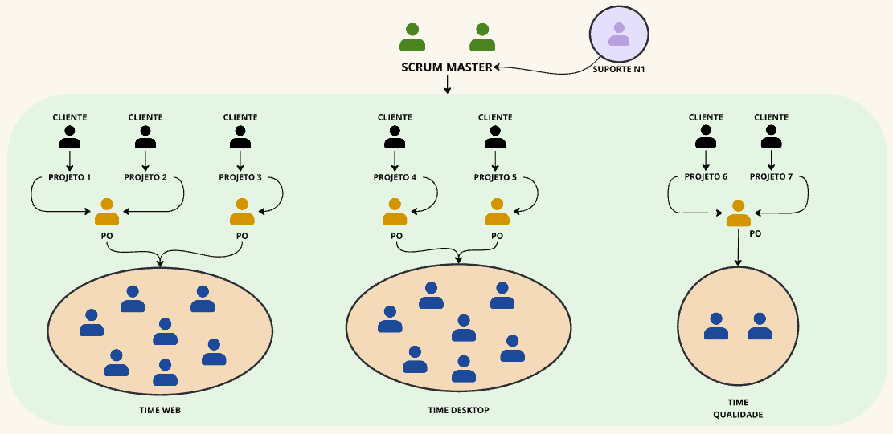

# Introdução

> 📌 **Este guia deve ser utilizado como material base nas trilhas de treinamento, onboarding de novos membros e reciclagem contínua das equipes.**

Este material serve como **base para trilhas de treinamento**, com o objetivo de nivelar o conhecimento das equipes, padronizar práticas e dar clareza sobre papéis, responsabilidades, cerimônias e diretrizes de trabalho.

---
## Reestruturação de Equipes

A Seção PDI e Produtos Digitais passou por uma reestruturação que preveu mudanças em toda a cadeia de processos que envolvem os projetos do PDI, desde a entrada da demanda até a finalização do projeto.

Utilizando conceitos de Metodologias Ágeis para estipular a nova estrutura de equipes, a ilustração demonstra visualmente a sugestão posteriormente aplicada a todos os grupos que trabalham com desenvolvimento de projetos.

---

